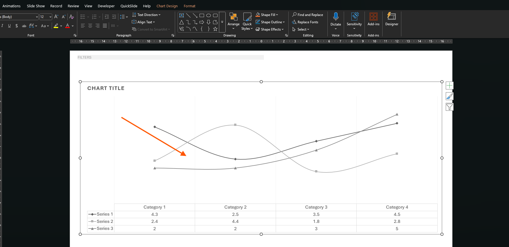
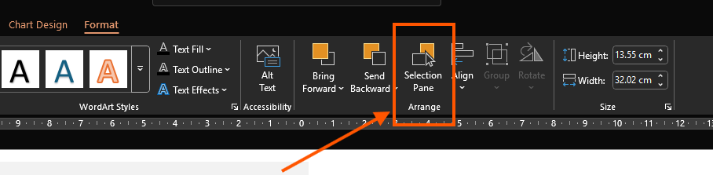
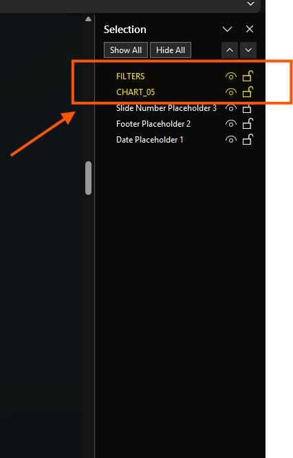

# **`PPTXShapeExtractor`**


## Description

`PPTXShapeExtractor` is a Python tool that extracts the structure of PowerPoint (`.pptx`) presentations into a structured JSON format. The script maps all visual elements of each slide—including simple shapes, charts, and grouped objects—while preserving hierarchy.

This tool is ideal for:

* Automating reporting and dashboards.
* Analyzing complex presentations with multiple groups of shapes and charts.
* Integrating slide content into other systems or applications using JSON.
* Preprocessing presentations for visualization or programmatic manipulation.

---

## Initial PowerPoint Configuration

To ensure proper extraction of elements, the PowerPoint file should follow these guidelines:

1. **Naming Shapes:**

   * Give meaningful names to shapes, headers, and value fields.
   * Recommended prefixes:

     * `"Header"` for titles and section headers
     * `"Val"` for values
     * `"Var"` for variables
     * `"Filter"` for filters

2. **Grouping Elements:**

   * Group related shapes to maintain hierarchy.
   * Grouped shapes are recursively parsed by the script.

3. **Charts:**

   * Charts are automatically detected if they exist in the slide.

4. **Ignore Connectors:**

   * Any shape with `"connector"` in its name will be ignored.

5. **Slides:**

   * Slide 1 always extracts all elements (`include_all=True`).
   * Other slides follow the filtering rules mentioned above.

---

## Directory Structure

```
C:\Users\70088884\ei-PPTXShapeExtractor
│
├─ template/                # Folder where your PPTX file must be placed
│   └─ template.pptx         # PowerPoint presentation to be extracted
│
├─ main.py                   # Python script
├─ pptx_extracted.json       # Output JSON file (generated after running the script)
├─ requirements.txt          # Required Python libraries
└─ README.md                 # Documentation
```

---

## Requirements

All dependencies are listed in `requirements.txt`. Install them with:

```bash
pip install -r requirements.txt
```

Required libraries:

* **python-pptx:** For parsing PowerPoint presentations.
* **json** (Python built-in): For saving structured data.

---

## How to Run

1. Place your `.pptx` file in the `template` folder.
2. Update the `pptx_path` in `main.py` if you use a different file name.
3. Run the script from the project root:

```bash
python main.py
```

4. The extracted JSON will be saved as `pptx_extracted.json` in the project root.
5. You can open the JSON in any text editor or load it into Python for further processing.

---

## JSON Output Example

```json
{
  "Slide_1": {
    "page": 1,
    "elements": [
      {
        "name": "Title",
        "type": "shape"
      },
      {
        "name": "SalesChart",
        "type": "chart"
      },
      {
        "name": "Group_1",
        "children": [
          {
            "name": "Header",
            "type": "shape"
          },
          {
            "name": "Val_2025",
            "type": "shape"
          }
        ]
      }
    ]
  },
  "Slide_2": {
    "page": 2,
    "elements": [...]
  }
}
```

---

## Notes

* The script automatically ignores connectors and irrelevant shapes.
* Meaningful naming of shapes in PowerPoint is essential for accurate extraction.
* Slide 1 always extracts all elements for a complete overview.

---

## Photos / Visual Reference Section
Follow these steps to properly configure your PowerPoint objects for extraction:

**1. Select the object**
Objects can be charts, labels, shapes, images, etc.



**2. Open the Selection Pane**
On the Ribbon, go to the Format tab and click Selection Pane.




**3. Rename objects for extraction**
A navigation pane will appear on the left side. You can rename any object that you want the script to extract.
Use clear and consistent names (e.g., Header, Val_2025, Chart_Sales).



---

## Footer

Thank you for using **PPTXShapeExtractor**!

For more information, support, or to report issues:

- **GitHub / Repository**: (insert repository link if available)

- **Email / Contact**: (insert contact email if desired)

## License

This project is released under the MIT License. You are free to use, modify, and distribute it with proper attribution.

## Acknowledgements

Built with python-pptx for PowerPoint manipulation.

JSON structure inspired by common reporting and dashboard standards.
